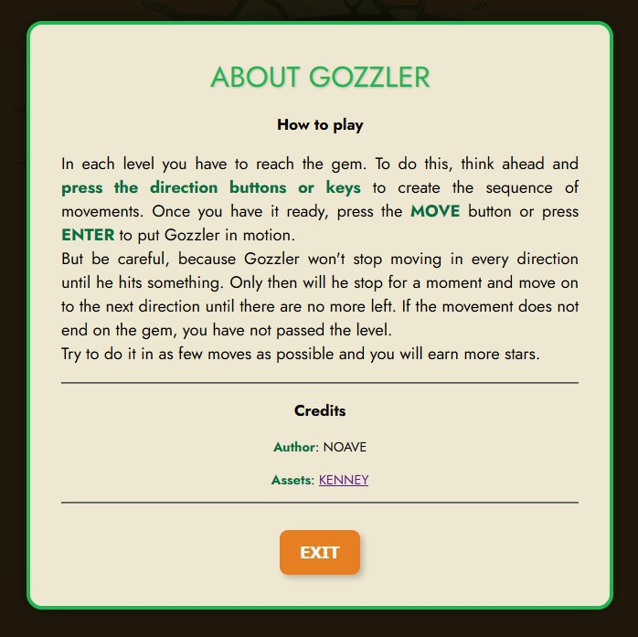
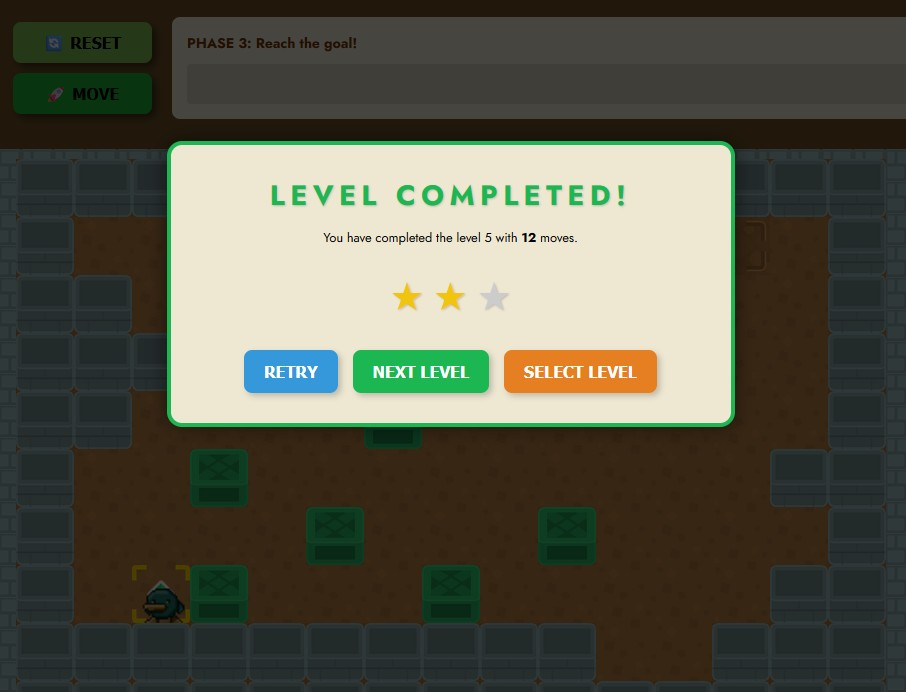

# NoaVelasco.github.io

> **Nota [250721]**  
> Actualmente, la página principal solo muestra enlaces a LinkedIn y Github. Está previsto incluir un portfolio más detallado, pero de momento el repositorio está pensado especialmente para alojar el juego en desarrollo.

## Gozzler
Juego indie de puzles en 2D con una mecánica basada en la programación de movimientos.

### Etiquetas
#casual #indie #2d #puzzle #pixel

## Cómo se juega

En cada nivel, el personaje comienza en un punto de inicio y debe acabar sobre la gema a través de escenarios predefinidos, pero con la particularidad de que nuestro personaje, una vez inicia su movimiento, no se detendrá hasta chocar con un obstáculo. Para superar el nivel, el jugador deberá estudiar el laberinto y anticipar qué movimientos debe realizar el personaje para llegar. Por lo general existe más de una secuencia de movimientos para resolver el puzle, pero el reto consiste en encontrar el recorrido que necesite menos movimientos.  

Para preprogramar los movimientos, el jugador cuenta con una consola virtual de botones de dirección. Tras pulsar la secuencia elegida y registrarla en la interfaz, solo hay que pulsar el botón _Move_ y el personaje iniciará su recorrido, un paso detrás de otro. 

Es posible que el jugador no logre resolver el puzle a la primera (o que su personaje muera en el intento). Contará con reintentos hasta que lo logre.

A medida que el jugador avance, la dificultad aumentará. Entrarán en juego enemigos que se interpondrán en su camino y objetos que cambian por completo las mecánicas del puzle.  

